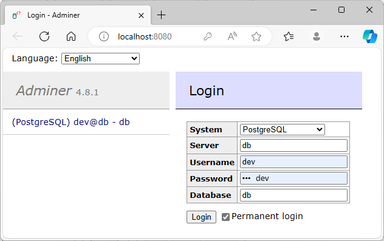

# REST API bazat pe Docker

## Cerinta
Rute expuse:
  - **POST** `/api/countries`
    - Adauga o tara in baza de date.
    - **Body**: `{nume: Str, lat: Double, lon: Double}` - obiect,
    - **Responses**: `201` `{id:Int}`; `400`; `409`
  - **GET** `/api/countries`
    - Returneaza toate tarile din baza de date.
    - **Responses**: `200` `[{id: Int, nume: Str, lat: Double, lon: Double}, {...}, ... ]` - lista de obiecte.
  - **PUT** `/api/countries/:id`
    - Modifica tara cu id-ul dat ca parametru.
    - **Body**: `{nume: Str, lat: Double, lon: Double}` - obiect.
    - **Responses**: `200`; `400`; `404`
  - **DELETE** `/api/countries/:id`
    - Sterge tara cu id-ul dat ca parametru.
    - **Responses**: `200`; `400`; `404`
  - **POST** `/api/cities`
    - Adauga un oras in baza de date.
    - **Body**: `{idTara: Int, nume: Str, lat: Double, lon: Double}` - obiect.
    - **Responses**: `201` `{id:Int}`; `400`; `409`
  - **GET** `/api/cities`
    - Returneaza toate orasele din baza de date.
    - **Responses**: `200` `[{id: Int, idTara: Int, nume: Str, lat: Double, lon: Double}, {...}, ... ]` - lista de obiecte.
  - **GET** `/api/cities/country/:id_Tara`
    - Returneaza toate orasele care apartin de tara primita ca parametru
    - **Responses**: `200` `[{id: Int, idTara: Int, nume: Str, lat: Double, lon: Double}, {...}, ... ]` - lista de obiecte.
  - **PUT** `/api/cities/:id`
    - Modifica orasul cu id-ul dat ca parametru.
    - **Body**: `{id: Int, idTara: Int, nume: Str, lat: Double, lon: Double}` - obiect.
    - **Responses**: `200`; `400`; `404`; `409`
  - **DELETE** `/api/cities/:id`
    - Sterge orasul cu id-ul dat ca parametru.
    - **Responses**: `200`; `400`; `404`
  - **POST** `/api/temperatures`
    - Adauga o temperatura in baza de date.
    - **Body**: `{id_oras: Int, valoare: Double}` - obiect.
    - **Responses**: `201` `{id:Int}`; `400`; `404`; `409`
  - **GET** `/api/temperatures?lat=Double&lon=Double&from=Date&until=Date`
    - Returneaza temperaturi in functie de latitudine, longitudine, data de
    inceput si/sau data de final. Ruta va raspunde indiferent de ce parametri
    de cerere se dau. Daca nu se trimite nimic, se vor intoarce toate
    temperaturile. Daca se da doar o coordonata, se face match pe ea. Daca se
    da doar un capat de interval, se respecta capatul de interval.
    - **Responses**: `200` `[{id: Int, valoare: Double, timestamp: Date}, {...}, ... ]` - lista de obiecte.
  - **GET** `/api/temperatures/cities/:id_oras?from=Date&until=Date`
    - Returneaza temperaturile pentru orasul dat ca parametru de cale in
    functie de data de inceput si/sau data de final. Ruta va raspunde
    indiferent de ce parametri de cerere se dau. Daca nu se trimite nimic, se
    vor intoarce toate temperaturile pentru orasul respectiv. Daca se da doar
    un capat de interval, se respecta capatul de interval.
    - **Responses**: `200` `[{id: Int, valoare: Double, timestamp: Date}, {...}, ... ]` - lista de obiecte.
  - **GET** `/api/temperatures/countries/:id_tara?from=Date&until=Date`
    - Returneaza temperaturile pentru tara data ca parametru de cale in functie
    de data de inceput si/sau data de final. Ruta va raspunde indiferent de ce
    parametri de cerere se dau. Daca nu se trimite nimic, se vor intoarce toate
    temperaturile pentru tara respectiva. Daca se da doar un capat de interval,
    se respecta capatul de interval.
    - **Responses**: `200` `[{id: Int, valoare: Double, timestamp: Date}, {...}, ... ]` - lista de obiecte.
  - **PUT** `/api/temperatures/:id`
    - Modifica temperatura cu id-ul dat ca parametru.
    - **Body**: `{id: Int, idOras: Int, valoare: Double}` - obiect.
    - **Responses**: `200`; `400`; `404`; `409`
  - **DELETE** `/api/temperatures/:id`
    - Sterge temperatura cu id-ul dat ca parametru.
    - **Responses**: `200`; `400`; `404`

## Solutia

### Servicii utilizate
  1. Python Flask: REST API
  2. PostgreSQL: baza de date
  3. [Adminer](https://hub.docker.com/_/adminer): tool de management de baza de date

  

### Initializarea serviciilor
#### Python Flask
Pentru rularea server-ului Flask in docker-compose am creat un Dockerfile care:
  1. Trage imaginea [python](https://hub.docker.com/_/python)
  2. Instaleaza dependentele din `requirements.txt`
  3. Porneste serverul de Flask cu variabilele environment necesare.

#### PostgreSQL
In Dockerfile-ul pentru baza de date se:
  1. Trage imaginea [postgres](https://hub.docker.com/_/postgres)
  2. Copie script-urile de initializare si resetare a bazei de date.

Impartirea in retele, expunerea serviciilor catre host, definirea volumelor si
alte setari sunt realizate in `compose.yaml`

### Conectarea API-ului la baza de date
Conexiunea la baza de date din Flask se realizeaza cu ajutorul [psycopg2](https://pypi.org/project/psycopg2/).
```python
# Parametri de conectare la baza de date
dbParams = {
  'dbname': 'db',
  'user': 'dev',
  'password': 'dev',
  'host': 'db',
  'port': 5432
}

# conectare la baza de date

conn = psycopg2.connect(**dbParams)
cur = conn.cursor()
```

Cererea datelor este realizata prin scrierea directa a codului SQL:
```python
# primeste ultimul id asignat pentru raspuns
cur.execute("""SELECT last_value FROM "Tari_id_seq";""")
```

Primirea rezultatului:
```python
cur.execute(f"""SELECT * FROM "Orase" WHERE id_tara = '{country_id}';""")

res = cur.fetchall()
```

Raspunsul primit este o lista de liste, de aceea de regula pentru a face ca
raspunsul sa corespunda la formatul din enunt, am folosit functii ajutatoare:
```python
# Transforma raspunsul pentru orase de la db in lista de dictionare pentru json.dumps()
def citiesListToDict(list):
    res = []
    for e in list:
        res.append({
            "id"     : e[0],
            "idTara" : e[1],
            "nume"   : e[2],
            "lat"    : e[3],
            "lon"    : e[4]
        })
    return res

...

return Response(json.dumps(citiesListToDict(res)), status=200)
```

La fiecare exceptie prinsa de la PostgreSQL trebuie sa dam `conn.rollback()`,
iar daca tanzactia a reusit `conn.commit()` pentru a salva datele in urma unui
`INSERT`, `UPDATE` sau `DELETE`.

La inserarea datelor in tabele db, id-ul initial va fi 1 si va creste cu pas de
1 automat la fiecare inserare, campul `id` fiind de tip `serial` in baza de date.

### Resetarea bazei de date
#### db/reset-db.sh
  1. Opreste containerul cu REST API pentru evitarea conflictelor.
  2. Curata tabelele si secventele, aduce baza de date la starea ca si cum ar fi
proaspat initializata.
  3. Porneste containerul cu REST API.

Pentru a asigura corectitudinea si evitarea testelor failed, se recomanda
resetarea bazei de date dupa rularea pachetului de teste. Chiar daca aplicatia aparent
lucreaza bine in orice caz, daca nu se executa testele de `Delete`, la unele 
teste, la urmatoarea rulare se poate da **fail**. Mai mult ca atat, chiar daca
se ruleaza suita de teste inclusiv cu testele `Delete` id-urile nu vor mai
incepe de la 1. Acest fapt nu influenteaza functionarea aplicatiei sau
rezultatele testeleor (pass sau fail). Aplicatia a fost testata cu suita de teste
[Tema2_script_testare_ordered.json](https://curs.upb.ro/2023/mod/forum/discuss.php?d=1564).

Pentru rutele in care primesc aceleasi id-uri in body si in URL-ul rutei, verific
existenta id-ului in body pentru a verifica integritatea cererii, insa mai
departe este ignorat. De exemplu la unul din testele `Put Temperature`:
```
URL: http://localhost:6000/api/temperatures/1

Request body:
{
    "id": 100001,
    "idOras": 1,
    "valoare": 50
}
```
raspunsul va fi `200 OK` deoarece va fi considerat id-ul din URL nu si cel din body.

```python
@server.route('/api/temperatures/<int:temperature_id>', methods=['PUT'])
def putTemperature(temperature_id):
    cur.execute(f"""SELECT EXISTS(SELECT 1 FROM "Temperaturi" WHERE id = '{temperature_id}');""")
    id_exists = cur.fetchone()[0]

    if id_exists == 0:
        return Response(status=404)

    content = request.get_json()

    try:
        _ = content["id"]
        cur.execute(f"""
                UPDATE "Temperaturi" SET valoare = '{content["valoare"]}', id_oras = '{content["idOras"]}'
                WHERE id = '{temperature_id}';
                """)
...
```

P.S. Alte detalii se pot gasi in comentarii in codul sursa, fisierele Dockerfile
si `compose.yaml`.

## Credits
Enuntul si cerinta proiectului/temei apartine echipei materiei *Sisteme de
programe pentru rețele de calculatoare* 2023-2024 din *Universitatea Națională de Știință și Tehnologie POLITEHNICA din București* - *Facultatea de Automatică și Calculatoare*.